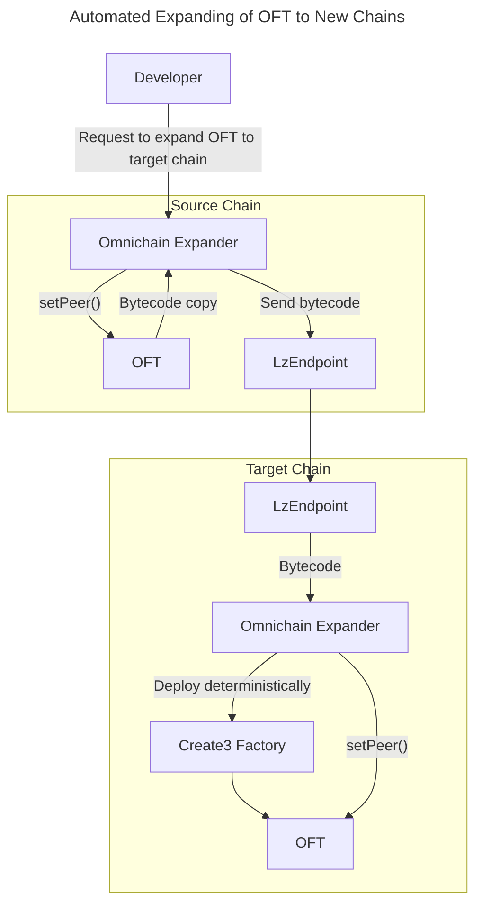
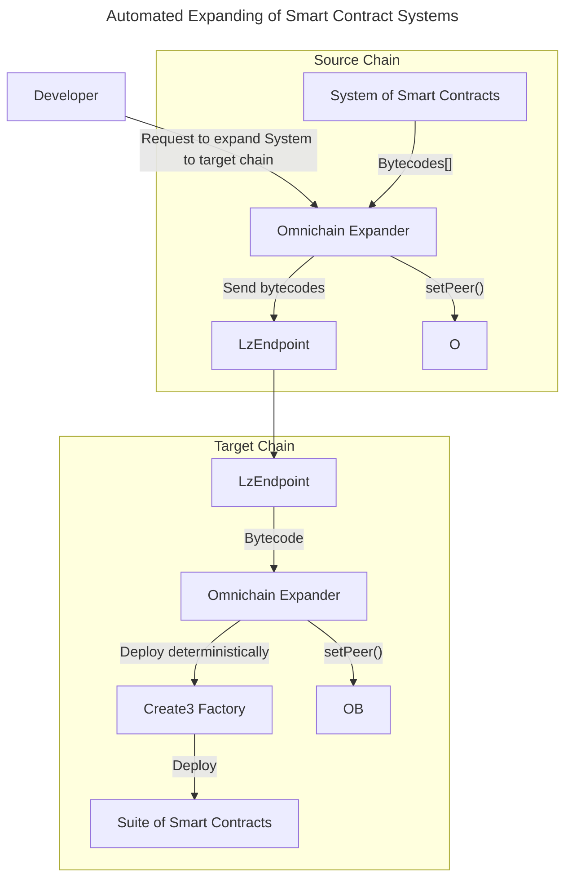

# Automatically Expanding Omnichain Systems

**STATUS:** DRAFT

## Authors

0xCompose

## Abstract

This document outlines a smart contract system designed to safely and securely expand to new blockchains without requiring validation that the contracts on the new blockchain are identical to existing ones. This approach eliminates the need for a DAO, allowing the protocol's community to avoid validating smart contract security themselves.

## Reasoning

To build secure and safe systems, projects typically require a DAO. However, DAOs are complex systems that can be manipulated, and having one from the outset may not be ideal for some startups. Additionally, DAOs do not address the challenge of safely expanding systems to new blockchains. Verifying that numerous smart contracts deployed on new chains are identical to existing ones can be difficult.

## Mechanism

The solution involves using cross-chain GMP protocols to copy the original contract's bytecode and deploy its copy on a new blockchain. Ideally, the same smart contracts should have the same address across blockchains. This can be achieved by deploying the contract deterministically using CREATE2 or CREATE3 mechanisms.

### Example: Expanding OFT to a New Chain



### Generalizing to Expand Smart Contract Suites



## Issues to Address

- **Constructor Arguments:** Deploying a system of smart contracts requires passing many parameters to constructors, which may vary between chains.
- **Large Smart Contracts:** Some contracts may approach the block gas limit, necessitating bytecode transmission in parts.
- **Initializable Smart Contracts:** Some contracts require an additional `init()` call with arbitrary parameters or initialization.
- **Self-Aware System:** Each system on every chain must know about all other chains to which contracts have expanded. This requires broadcasting new chain additions to all deployed systems.
- **Same Address Deployment:** Each smart contract must have a unique identifier to ensure deployment to the same address.
- **Deterministic Deployment Collisions:** Original smart contract deployment must occur only once to avoid address collisions.
- **Interdependent Contracts:** Some contracts depend on others, requiring the deployment of one contract to deploy another.
- **Migrating Non-Expandable Systems:** Integrating existing systems into the expanding framework is challenging but feasible.
- **Cost-Effective Bytecode Retrieval:** Using LZ Read for bytecode retrieval can be cheaper but may require separate transactions for retrieval and deployment.

Most potential issues relate to constructor and init function arguments, which cannot always be generalized. Allowing arbitrary parameters without validation can lead to malicious smart contract configurations. Solutions include a registry for verified addresses or on-chain deployment scenarios with configurable options.

## Solving Omnichain Deployment with MAAT's Example

To expand a system like MAAT, the following scenario can be implemented:

```js
deploy MaatAddressProviderV1(address proxyAdmin, address providerAdmin)
deploy MaatOracleGlobalPPS(address admin, uint oracleDelta, address(MaatAddressProviderV1))
deploy MaatVaultV1(uint chainId, address(USDC), address commanderUSDC, uint minAmountToDepositInVault, bool isDepositAllowed)

// TODO: Set related Vaults for USDC vault

deploy MaatVaultV1(uint chainId, address(USDT), address commanderUSDT, uint minAmountToDepositInVault, bool isDepositAllowed)

// TODO: Set related Vaults for USDT vault

deploy StargateAdapter(address admin, address(MaatAddressProviderV1), uint32 srcEid, address(LzEndpoint))

// TODO: Set peers for StargateAdapter

// TODO: Set vaults and stargate adapter in MaatAddressProviderV1
```

### Variables to Specify

```js
{
    "MaatAddressProviderV1": {
        "proxyAdmin": "0x...",
        "providerAdmin": "0x...",
    },
    "MaatOracleGlobalPPS": {
        "admin": "0x...",
        "oracleDelta": 10000000,
        "MaatAddressProviderV1": "0x... (taken after deployment)"
    },
    "MaatVaultV1": {
        "chainId": 137,
        "asset": "USDC address variable",
        "commander": "commanderUSDC variable",
        "minAmountToDepositInVault": 1000000,
        "isDepositAllowed": true
    },
    "MaatVaultV1": {
        "chainId": 137,
        "asset": "USDT address variable",
        "commander": "commanderUSDT variable",
        "minAmountToDepositInVault": 1000000,
        "isDepositAllowed": true
    },
    "StargateAdapter": {
        "admin": "0x...",
        "addressProvider": "address(MaatAddressProviderV1)",
        "srcEid": "uint srcEid variable",
        "lzEndpoint": "LzEndpoint address variable"
    }
}
```

To implement such scenario execution, inspiration can be drawn from Aragon's DAO commands building and execution via [EVMCrispr](https://docs.evmcrispr.com/cookbook/aragonRecipes/).
