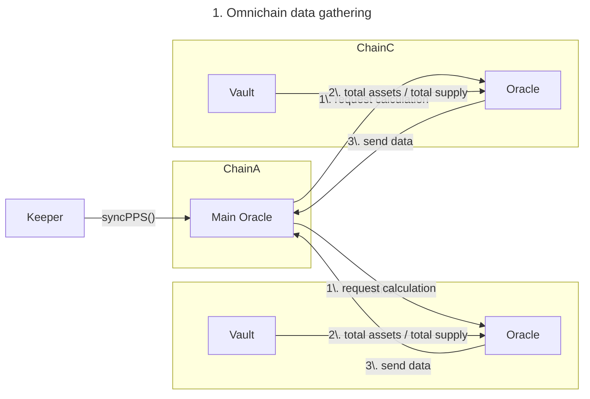
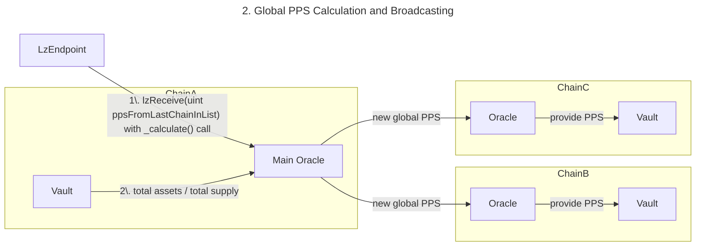
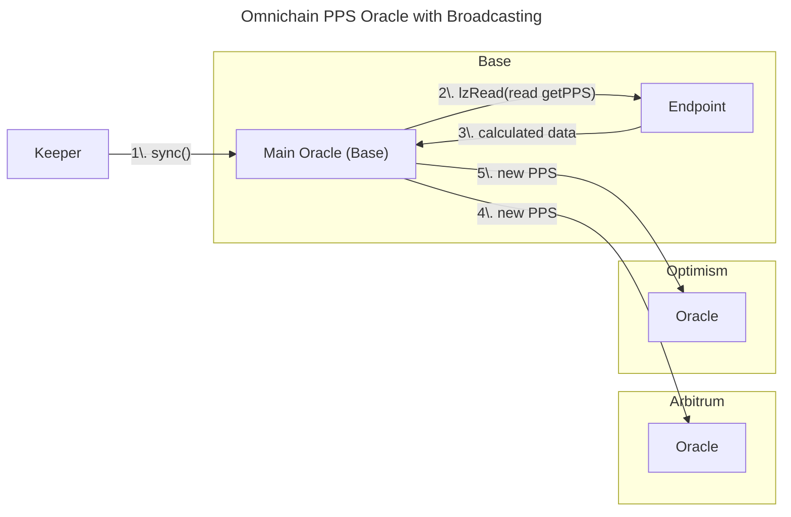
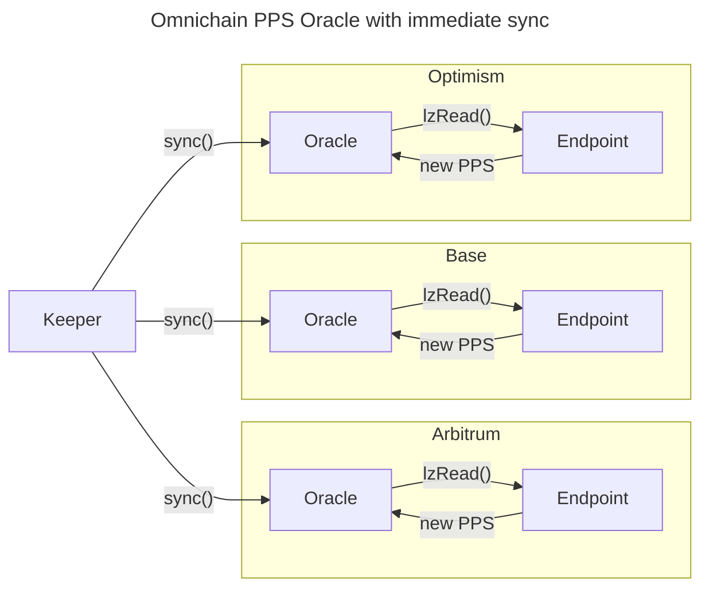

# Omnichain Oracles

**STATUS:** DRAFT

## Authors

0xCompose, 0xKick, 0xMarvin, 0xM2acesT, 0xNitro

## Abstract

We introduce omnichain global price per share (PPS) oracles to enhance the security and reliability of omnichain vaults.

## Reasoning

For MAAT Finance, a secure method is needed to calculate the global PPS for Omnichain ERC4626 vaults using data from multiple blockchains and smart contracts.

Currently, the calculation is centralized, performed off-chain, and subsequently stored on an Oracle contract on each chain. This method is insecure, susceptible to manipulation, and prone to calculation errors. For instance, PPS calculation errors have occurred due to indexer degradation on some chains, leading to incorrect data being passed to the calculation module and incorrect PPS being stored on-chain.

## Mechanism

### Without LZ Read

The initial concept, developed before the LZ Read announcement, involved two steps: data gathering and broadcasting.





### With LZ Read

LZ Read simplifies data gathering and potentially eliminates the need for broadcasting. It is also expected to be more cost-effective compared to messaging for data gathering. This optimization in oracle management costs makes the concept viable, as messaging costs would otherwise necessitate synchronization only upon request or make synchronization infrequent, affecting protocol liveness.

To calculate new PPS via LzRead, functions to get total assets and total supply on every Vault contract on each chain are required. The `totalAssets()` function should aggregate assets from all active strategies in the Vault, while `totalSupply()` is a contract field that can be easily accessed.

The general solution is as follows:

```solidity
contract OracleGlobalPPS {
    // ... code ...

    struct RawPPSData {
        uint totalAssets;
        uint totalSupply;
    }

    function lzReduce(bytes calldata cmd, bytes calldata responses) returns(bytes memory) {
        require(responses.length == chainsAdded, "Expected all added chains to return PPS data");

        RawPPSData memory data = abi.decode(responses, (RawPPSData[]));

        uint globalAssets;
        uint globalSupply;

        for (uint i = 0; i < data.length; i++) {
            globalAssets += data[i].totalAssets;
            globalSupply += data[i].totalSupply;
        }

        uint pps = globalAssets * 10 ** decimals / globalSupply; // oracle decimals = 8
        return abi.encode(pps);
    }

    // ... code ...
}

contract MaatVaultV1 {
    // ... code ...

    struct RawPPSData {
        uint totalAssets;
        uint totalSupply;
    }

    function getPPS() returns(bytes memory) {
        RawPPSData memory data = new RawPPSData(
            totalAssets(),
            totalSupply()
        );
        return abi.encode(data);
    }

    // ... code ...
}
```

The interaction scheme is as follows:





Choosing the implementation will depend on:

- Cost of each method
- Simplicity of implementation and synchronization triggering
- Update latency to prevent arbitrage between chains

## Issues to Solve

- **Bridge Awareness:** The system must account for assets deducted from strategies or vault contracts during bridging. A method to account for in-flight bridges is needed.
- **High Costs (solved with lzRead):** LZ message sending can be costly, necessitating infrequent synchronization or synchronization only upon request. A bounty system could incentivize synchronization when calculations deviate by a specific basis point value.
- **Immediate Calculation Errors (solved with lzRead):** Synchronization can take up to 30 minutes, during which new deposits or withdrawals may alter the global contract state. Data should be gathered at specific timestamps or block numbers to mitigate this, similar to how asset balances are obtained for all vaults and strategies.

This approach may result in a lagging PPS, but the slight reduction in PPS should not pose a significant issue. Each Vault/Strategy contract can snapshot totalSupply/totalAssets at every deposit/withdraw action.

## Other Omnichain Oracle Use Cases

- Bridging values from oracles to chains lacking oracle infrastructure.
- Omnichain APY Oracles: enabling on-chain decision-making for rebalancing.
